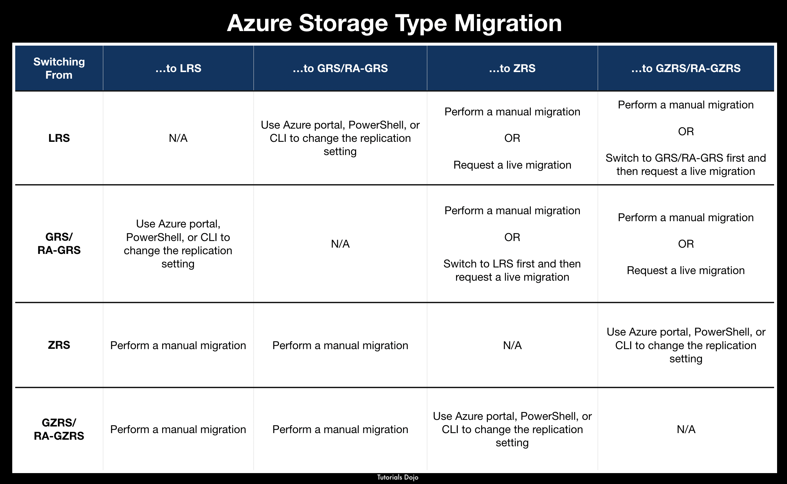

# more azure notes

## Azure Basics

AZ info -- <AprAz2024AKA@hotmail.com>  

### The CLI

can run from the cli in the cloud  
if running from local need to install the AZ modules  
why run local - save scripts etc.  

```powershell
install-module -name az -allowclobber -respository psgallery  
update-module ...  
```  

### Identity management - MODULE 4 INTRODUCTION TO ENTRA ID  

Entra is the cloud version of identity management, same but different than AD -- does not use Kerberos or LDAP uses OAUTH and SAML  
there is a free tier, create users and groups but offers little else - no reporting, no SLA, no security features    
not all users need to be on paid plans, some can remain on the free tier, some can be p1, etc.  
**account** - a person or app service account (managed identity)  
**tenant**  - a business or corporation, a unique domain name, every account is part of a tenant  
 requires a paid sub to make a MS one  
 can create a B2C tenant and use other accounts to authenticate, google, facebook.. etc  
**subscription** - the billing arrangement, free, pay-as-you-go, enterprise agreements, etc.  tenants can have more than one subscription  
global admin can do anything, first user, built in role  
more roles are unlocked with the P2 tier  

**Learned in mod 4** - how to add a custom domain, what is a tenant, creating a user account, creating a new tenant, some view settings 
**homework -- check these settings locally**

---

### Mod 5 users,groups and identity  

can have member users or guests users, can create users from a csv template for bulk operations, can sync with on prem AD and import some or all users  

- dynamic groups requires extra licenses (examples followed assume azure first users)  

free tier supports up to 500k objects - users, groups, contacts = objects  
users can be deleted pretty easily  

can audit or review group through logs from the activity panel  

can't add licenses to a user until the location is set  

in order to refresh to view of licenses it's REPROCESS  

again licenses only add features that the user needs, saves money  

roles allow you to group users by function - i.e helpdesk role can reset passwords of a certain tier across the company  
administrative unit separates the roles even further, continuing with the helpdesk role you can set that helpdesk admins can only help the finance dept. etc. etc.  

in my example I added teachers to the helpdesk role, then to further lock it down added an administrative unit, named it Classroom 1 since that's teacher 1's room - then added the students. this allows teacher 1 to **only** reset the student passwords in classroom 1.  
administrative groups can contain groups and devices, possibly apps  

devices are physical objects that authenticate through azure  
managed devices allow a standard for access things like - encryption, malware protection, device OS, age can all be evaluated  
external users -- providing access to users, contractors, etc outside of the domain, invite an external user create as guest user - can set all policies the same against them as a noraml user  
self service password reset does require all users to have a license that includes it  

**learned in module 5** adding users, groups, dynamic groups require a p2 license, how to use and configure roles and administrative units, the idea behind self-service password reset, can be turned on or off, requires licenses.  
**homework -- check these settings locally**

---

### MOD 6 - RBAC

Role based helps treat all users 'the same' users are assigned to roles and that's that.  
there are **a lot** of built in roles 
storage accounts are normally secured by keys, CBAC (or claims based access control) this can be changed in the configuration pane, once that's changed any access using keys is immediately broken  
how to assign users to the storage account? IAM panel - three basic kinds of roles (reader, owner, contributer)
after getting access to data blobs through roles then when creating containers can add and view data  
roles and assignments can be set very granularly and at every level, subscription, container, resource, etc, also defined in json and have some special properties, action, notations, assignable scope  
custom roles can be made using old roles as a template or creating a completely new role  
how to view all permissions to an object? -- under access controls there is role assignments, also in azure ad choose the user and view azure role assignments (for objects), assigned roles (for entra management)
to deny you have to do it through azure blueprints - allows you to create from scratch or based on existing templates  
assigned memberships allow for expiration of groups

#### what I learned mod 6

 rbac management helps with security by assigning the same role to every person, helps with permission creep. this can be a trap though, there are a lot of clicks and it gets very granular, are you assigning permissions at the group or tenant level? or the subscription level? or even the file level? the highest permission still wins. denying users access is easier done by just not giving it to them, it's possible to create custom deny rules but not through the IAM panel

### MOD 7 - MANAGE SUBSCRIPTIONS AND GOVERNANCE

ACCOUNT - a user id, or an applications account, basis for authentication, roles security and access to resources, are assigned resources
SUBSCRIPTION - an agreement with MS to use Azure services, resource usage gets billed to the payment method of the sub. not every tenant has a subscription, but to use services you need to use a subscription, sometimes multiple
TENANT - a representation of an org, like a domain name, a dedicated instance of azure AD (entra) 'peabrain products', ms appends onmicrosoft.com to the end of all tenants automatically
RESOURCE - any entity managed by azure, VMs, web apps, storage account, IP addresses, NICs, network security groups  
RESOURCE GROUP - a collection of resources usually for logical management, resources can only belong to one resource group, can lock a resource group, read only or block delete, block even owners from making changes or deleting (of course an owner can remove a lock)
you create a user, they're a part of a tenant (or AD), but in order to create a VM or something like that a subscription is needed or some way to bill, sometimes multiples subscriptions are used - so some resources are charged to one account and others to another
**management groups** -  can contain subscriptions, another way to control permission levels at the subscription level, blueprints can contain a prototype subscription and then you can deploy from that level, can review activity done on the group in the activity logs section for that group  
the subscription page shows the details and costs of the subscription, can break the cost down in several ways, can set pricing alerts for different events  
Polices (written in json) allow for rules set - like minimum OS version, etc. polices can be assigned to subscriptions and resource groups, can also make exclusions, the exclusion can block or just report when the policy is violated, non-compliance message can also be set, the compliance tab allows you to see what does meet the policy and provide remediation, there are many templates and each template can be modified to fit specific use-cases
how would you test a policy - most policies take about 30 min to enable
tags allow you to logically manage resources and groups, a key/value pairing - SERVERS - production, 
US - network, etc, details on who manages the resources, another way to manage without assigning to resource groups, no templates since this is all self made, can set a policy that enforces tags  
resources can be moved from one resource group to another or even another subscription, or a region, once that's done things that depend on the resource need to be updated since the resource ID will change  
policies can be managed through powershell also - it's actually better to get away from the portal and develop script sets  
policies are pre-deployment security solutions and locks are post-deployment solutions  

### MOD 8 - creating storage accounts  

**basics**  
belong to one subscription and a resource group, needs a name too that becomes part of the URL, also needs to be globally unique  
storage accounts are deployed to regions, pricing and governance can be different based on region and redundancy selections, best to closet to user  
when making the account need to select redundancy options, even the lowest copy makes 3 copies in the same region, zone redundant two copies in different locations in same zone, geo redundant two regions, geo and zone two different regions and zones 

**advanced tab**  
this is where secure access, allowing anonymous users, storage key access, tls version, datalink endpoints, and *blob storage access tiers* - are configured (hot or cool - this also affects pricing), hot is for frequently used data and cool for backups, logs, etc. hot is cheaper to write to and cool is more expensive to read from - this can be changed later

**networking**  
here can set where the storage account can be accessed from (publicly or locked down to certain accounts) and how the routing works either using MS internal networking or the public network  

**data protection**  
recovery and tracking control -- soft delete allows for recovery up to 7 days, point in time allows for versioning, tracking allows blobs to be tracked with version number (this does increase cost), or can just keep a log of the changes without keeping the blob file, access control prevents unwanted deletion of files - log files, auditing files etc.  

**encryption**  
data is encrypted by default, options are MS managing encryption keys or locally managing the keys - if locally managed need a key vault and a managed identity, there is also another layer of encryption at the hardware layer, infrastructure encryption  

**tags**  
assigning tags .. then validate  

containers on the storage dashboard is blob storage, it's a box to upload files into,  this can be done manually or through programs or something logically, how to access? with url AND access key
fileshares are more traditional, creating a fileshare like a W drive or something like that using SMB...when you create one few types of access tiers will popup, once created it's browsable like a regular file explorer, connect it to the pc with a script but 445 needs to be able to get through
queues -- like a messaging system between applications
tables -- are kind of like a loose database, like that ms access

**how to access files**  
*access keys* - how to access files in storage accounts - access keys, every account gets 2, you can rotate keys manually or with a rotation reminder, once a key is regenerated all previous access is revoked
another way to grant access is *shared access signatures* - under there you generate the key by selecting shared access signature, permissions you want to grant and then generate the token -- append to the end of the container string, there should be a question mark in the string but you have to append it, weird..the cleartext dates for access are in the string but also included is an encryption string based on the access key shown when generating the SAS -- these can also be created at the file level  
another way is stored access policies - a condition on a shared access signature - these can be revoked as well, can be made in powershell .. making it is kind of like an abbreviated SAS key -- once made and back in the SAS screen for the file there will be a Stored Access policy that can be applied that automatically sets the other features .. since you can't delete keys willy nilly, you can delete policies though -- if a policy is assigned and then deleted access is revoked while retaining keys
*entra id* - so keys are good, but what about enabling users internally? first it needs to be enabled in configuration, then the user needs to be added to a role in IAM - there can be conditions applied
data validation ? 


**redundant storage**  
locally redundant = 3 additional copies in the same region  
configuration can be changed though - under redundancy can change to other options, some might not be available in the region the storage account has been created in 
geo redundant = files in another region  
if read only redundancy is created then multiple endpoints are created (some for read only)
once geo redundancy is configured then a failover can be done manually or automatically whenever access is lost - however some data may be lost, it also displays last sync time
-what's a premium storage account? -- faster drive, better read write access, less space though - only supports page blobs, block blobs and file shares  
back to access tiers - there are more than hot and cold, cool and archive are also available for files -- if tiers are moved there are some minimum charges based on days, 30, 120 for cool and cold. 180 for archiving takes the file offline completely, it's no longer accessible, just there - VERY CHEAP. hot files are expensive to store, cheap to write and read from. everything else is opposite to a degrees. 
*soft delete* for fileshares, allowing for recovery allows for up to 365 days to recover, once soft delete is enabled a lock is created by default to disable deletion, once you remove that  
*backups* - more fileshare stuff .. backups run regularly or can be done manually  
*snapshot* - for fileshare thing to do before a change - take a snapshot - go into the backup and can retrieve individual files instead of restoring the whole share, does not expire.  
**versioning**  
for blobs - this can be turned on initially, enabling it means everytime a file is added it adds a version backup of the blob. consider storage costs, MS recommends keeping less that 1000x copies of a file. this can be rotated too. does not protect against container deletion, that's for soft deletion only for blob files
deletion of backups, snapshots and versions can also be managed globally by lifecycle rules -- can move to different access tiers.  

**tracking**  
monitoring allows tracking of file access, creation and latency, can create alerts for various events, workbooks are templates that have been created as templates of analytic types

#### what I learned here

again many ways to the top of the mountain. easy to trip over your own toes here when creating management polices are storage accounts. there are many options when making a storage account - what kind of files it'll hold, how to access, where to put, how to back it up, who can access. these can be configured at a high level when creating the storage account but then fine tuned later. always consider how the data is going to be used when assigning storage policies. some keywords, hot, cold, cool, archive, blob, containers, fileshares, access keys, shared access keys, storage account  

### mod 10 - manage storage accounts

lots of different ways to get data in and out of a storage account. little files it's OK to do manually ... large files need data box, that needs a license and azure will ship a physical USB drive to put data on ... smh. smallest job on that page allows the building of a job up to 1tb, the user provides their own disk and runs some tools to prep it. azure backup needs trusted services to be used ... azure import/export is used to securely migrate large amounts of data to blob and file storage, there is the dataset csv file (list of files and folders) and the driveset csv file (list of directories) to prep for the job

getting data out of azure is mostly the same - export instead of import and they ship the data to the user in another data box, the user can also ship sata drives back  


azcopy is a cmd line tool that allows the user to run the copy process like an application - when installing can use the path option to allow it to be used freely from the cmd line  

``` powershell
azcopy  copy c:\mystuff <blobsasurl> #this will use a shared access signature or SAS
```  

managing storage accounts - storage browser can also be downloaded and connected to and can browse files locally. object replication physically moves files between storage containers i.e main to backup, etc. object replication could move and lifecycle management could do the rest, downgrade the file etc. move the object to target container before changing lifecyle, when replication is enabled change and versioning feed are going to be enabled - these are just records. it can be moved in the same storage account, just different containers. for object replication, it's asynchronous and there is no SLA on time

### mod 11 - configure azure files

new storage account has default of 5ptb (sick). mine only had 5 tb, whatever.  
again blob vs file share > file share is going to be able to connect to a local network using SMB and has a real hierarchical structure, blobs do not have these features - can't point a VM fileshare to a blob, not all ISPs support SMB over the internet - better to use a VPN. Azure provides a script to connect but this only works on Windows server 2012 or higher. however blobs are the best storage option in azure  

``` bash
azcopy make "https://[account-name].blob.core.windows.net/[top-level-resource-name]"
#makes a blob object  
```
**azure storage explorer** - allows copying local files to azure using an application and the internet, it allows uploading, downloading and managing of blobs, files, queues and tbales
**azure file sync** allows use of a local network server and then have the files synced to the cloud, server is set as a cache and then, you create the sync service, download the software, install and register the servers - files stored on servers to be stored centrally in an azure file share that needs to be premade and handles the syncing and versioning of those files in the background, accessible by SMB - multiple vms and servers sharing the same files, if a change is made on the cloud side takes 24 hours to update, does not overwrite files - just keeps the file and conflict number (up to 100 per file),  
**premium storage accounts** -- for the most part standard general purpose does the job, premium tier allows for block or page blobs and file shares. the names refer to write sizes - blocks are written in blocks, low latency, fast writes, video processing, databases etc. page blobs are typically larger than blocks - used for storing files that don't require a lot of interaction - good for random read and writes, like log files. does not have global redundancy, global or zone only. block blobs can be a datalake - pages cannot, you still get recovery.  
**redundancy tiers**
Locally redundant storage (LRS) copies your data synchronously three times within a single physical location in the primary region. LRS is the least expensive replication option but is not recommended for applications requiring high availability.
Zone-redundant storage (ZRS) copies your data synchronously across three Azure availability zones in the primary region. For applications requiring high availability.
Geo-redundant storage (GRS) copies your data synchronously three times within a single physical location in the primary region using LRS. It then copies your data asynchronously to a single physical location in a secondary region that is hundreds of miles away from the primary region.
Geo-zone-redundant storage (GZRS) copies your data synchronously across three Azure availability zones in the primary region using ZRS. It then copies your data asynchronously to a single physical location in the secondary region.



#### what I learned in this module

I need to make a local domain and test syncing to get closer to real life action. anyway, storage - containers can hold storage accounts, in the storage accounts files can be organized in a few different ways, file shares or blobs, blobs are great for read only access, web pictures, etc. file shares can connect to VMs, local servers etc through SMB like a regular file share. Regardless of how it's stored, files can be managed by a lifecycle, replicating, backing up, moving access tiers, moving containers etc can be managed through lifecycle management, replication and policies. premium storage accounts allow for more expensive (larger) read write operations but redundancy is lost. most storage account and file management can be done from the console but it's recommended to do it programmatically or from desktop apps. to import large files they send a physical file-share of proportionate size 😂.  

### mod 12 -- VMS  (stuff I've never done)  

when you create good to make a new resource group since several other resources will be created with it
some new option - security type (standard, trusted launch virtual (tpm),confidential), azure spot discount (vm is cheaper but the runspace can be used by other paying customers preferentially), size (d series is standard normal VM, best to choose latest D series, B series (burstable) CPU can burst to higher speed sometimes, E series more memory (databases), F 2x performance, lots of other different options), username, allowed inbound ports (ssh is mostly for linux)
**disks** - OS disk - can select type, a new vm has some temp storage - these are not good for storage. use a data disk (limits are selected by the size vm in previous screen), bitlocker can be enabled here and MS can store the key (isn't in free sub),  
**networking** - every vm has to belong to a virtual network, virtual machine network region and vm region must be the same, options to select network range and some security options,  accelerated networking is for vm to vm communication, load balancer options either tcp/udp or web traffic preferred 
**management** - ms defender is now turned on always, system assigned identity - allows you to assign a role to the machine as a user, enable azure ad login, auto shutdown options for testing or development, backup options, site recovery (duplication in another region), os auto updates (hotpatch allows updates with reboot),
**monitoring** - alert rules - every alert costs 10c a month, diagnostics
**advanced** - enable extensions before deploying the image, openssh, desired state config etc. options for privacy and further performance tweaks, the option to reserve a vm by paying for it in advance 🤣. proximity tries to keep the physical machines close in order to improve performance. so when you click create theres already a bunch of standing VMs with mostly my specs - it's grabbed renamed and rebooted, so strange.  
**connecting to a vm** - few ways to connect, configured when created. however bastion is a new one - connect to it using azure ad and then log in using rdp.  
connecting via rdp is a file - launch as normal.  
another way is to use bastion -- a jump station basically, doesn't connect directly, no open ports needed or public IP, connect to second server - costs per hour 😊, basic and standard versions different features, different pricing - when bastion is deployed it's in the same resource group and same region but not in the same subnet at least \26, need multiple bastion servers if multiple people will connect, when connecting it's done through the browser, most secure way to connect to a vm  
**availability**  - availability options  works when you have multiple vms with the same purpose, you create them as a set - fault domains, 2 fault domains 2  vms = completely different power sources and regions, update domains up to 20 are for planned maint. 
the vm can be resized while it's running just head to size and change settings  
**disks** - can add additional disks up to the size limit, premium or standard, can choose size and storage type, cost is based on provisioned amount not used amount, when a disk is added it must be added to the OS like a regular disk, can detach the disk while the machine is running - detaching does not delete the drive - it can be reattached in the disks pane - (how do you know how many disks are detached?)  
**azure scale sets** - vertical vs horizontal - vertical is adding to the machine itself, more ram, more cpu, more disk space etc. - limits to scaling up, it's disruptive to the machine and it might not make things better, another way to scale is horizontally - adding more machines to the problem - no limit and it's not disruptive, ms uses *virtual machine scale set* service - when creating this resource same as bastion - need to add it to a resource group, orchestration  mode option - uniform vs flexible, flexible is good for many machines 30+ - does not use availability sets so each machine is actually different - can mix OSs etc - neat, traditional is all the same. they do not load balance automatically. there is a pretty detailed autoscaling feature within the scale set configuration, the default scale set limit is 100. can select applications to install on creation, can create a scale set from a template vm.  
**creating a vm in powershell** - most common way of creating a VM, powershell or bash

```powershell
#first create a resource group, don't have to but a good idea
new-azresourcegroup -name xxx1 -location eastus
new-azvm -name xxx -credential xxx -location eastus -resourcegroup xxx1 #only name and credential are mandatory
```

windows features can also be installed via powershell

```powershell
invoke-azvmruncommand -ResourceGroupName 'myrg' -VMName 'psazureabvm2024' -CommandId 'runpowershellscript' -scriptstring 'install-windowsfeature -name web-server -includemanagementtools'
```

the vm can also be started and stopped from powershell - anything that can be done in the portal can be done in PS, when the machine is stopped it's deallocated and that looses it's IP address so if you're using RDP you'll need a new connection

```powershell
stop-azvm -name xxx -resourcegroupname xxx
start-azvm -name xxx -resourcegroupname xxx
restart-azvm -name xxx -resourcegroupname xxx
remove-azvm ....
remove-azresourcegroup ....
```

this can also be done in bash 

```bash
az vm create --name xxx --resource-group xxx --image xxx
az group delete --name xxx
```

#### what I learned mod 12

azure vms are very flexible and built for scaling. every vm must belong to a resource group and have a virtual network. Can configure pretty much anything before load (powershell or cli is preferred), can use azure scale sets to scale in and out, many way to connect (bastion is preferred) - bastion runs on a subnet of the vm's network. vm configuration can be changed on the fly.  

### mod 13 automate deployment of resources by using templates

ARM templates -(azure resource management) centralized deployment model that's running in the background of all resource configuration ... written in json templates. after creating a resource at the end there is usually a 'download a template for automation' link that provides json file with all the settings that have been configured. 2 main files to create a resource - template file and parameters
schema is a fixed string - content version allows versioning 
template file - parameters - value that can be passed into the template , variables - come from inside the template not outside, resources - most important part (array so a lot of stuff, disk drive, network infrastructure, etc. etc.), outputs  . does not pass password into the the vm.  
after modifying a template there are a few options -- add to library and deploy
templates are being phased out -- template specs are the place to store them now
for the most part when using template specs it's still manual process 
if the same arm template is deployed again a diff check is done and only things that are changed are deployed.
there are maximum amounts of templates allowed ...
besides ARM templates there are bicep templates, write in bicep translate to ARM - supposedly easier in all aspects, read, write, learn

``` powershell
new-azresouredeployment #deploys a template in powershell
```

### mod 15 - app services

so usually in azure the hardware is unknown when using app services, code is uploaded and azure runs it  
advantages - lots of deployment options, integrations into github, networking, azure devops etc., a little like putting code on an IIS machine  
**creating a web app** - have to choose where to publish it from, code, container, static web app, what kind of runtime stack you're using, language and version (.net, java, php, etc some are cross platform (what os it can be run on) some are not), region and zone redundancy, different compute plans for pricing are avail. *deployment screen* - can add continuous deployment for ease of deployment, just enable and connect to github, there are rules and filters available for setup too, *networking* - is pretty simple - access public network or allow internal networking access  

**managing a web app** - once made under deployment slots can see the web app, can use like an A/B test can send some traffic to one and some to another or can swap which is production and which is not.  

- *deployment center* shows where the source code is coming from, sftp, github, bitbucket, etc.  
- *configuration* - application settings allow for variable breakout in the code, sensitive values can be stored here, an api key or something like that. connection settings allow for the same with database settings. can mount files to be used on the app also, very similar to IIS settings,  

there are settings as well to scale up automatically when needed in those plans is something called azure compute units kinda gives an abstract on how to compare performance of deployments, scaling isn't disruptive, it can be done manually or automatically by rules needs scale in and scale out rules, doesn't drop the new instances automatically (on the premium plan it does)  

- *backups* - backups are automatic every one hour up to 30 gb, no linked DBs are backed up. Kinda like IIS. But can create own custom backups.  
- *network* - inbound, outbound and rules, source IP address for firewall rules, public IP address, can also have a custom domain. 

DangerBoy
JumpUp2Top33!