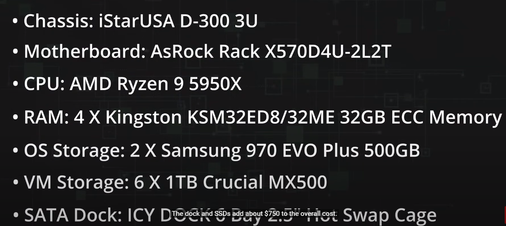

## intro to proxmox  

the hardware he's using -- 
- asus asrock 5950g motherboard  
- hard disk dock (the chassis)  

maybe not this case because no power supply fits

1. create the media  
2. boot and configure the installation, hostname, ip range
3. update proxmox - click on the name of the node > updates > refresh
4. enable the no sub repo repositories > add > 'no-subscription'
5. update and upgrade again 
6. select the proxmox node and click reboot
7. create a VM

